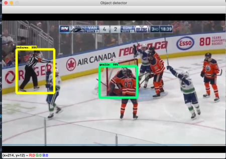
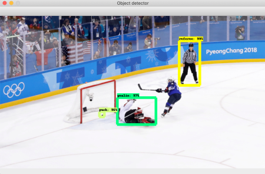
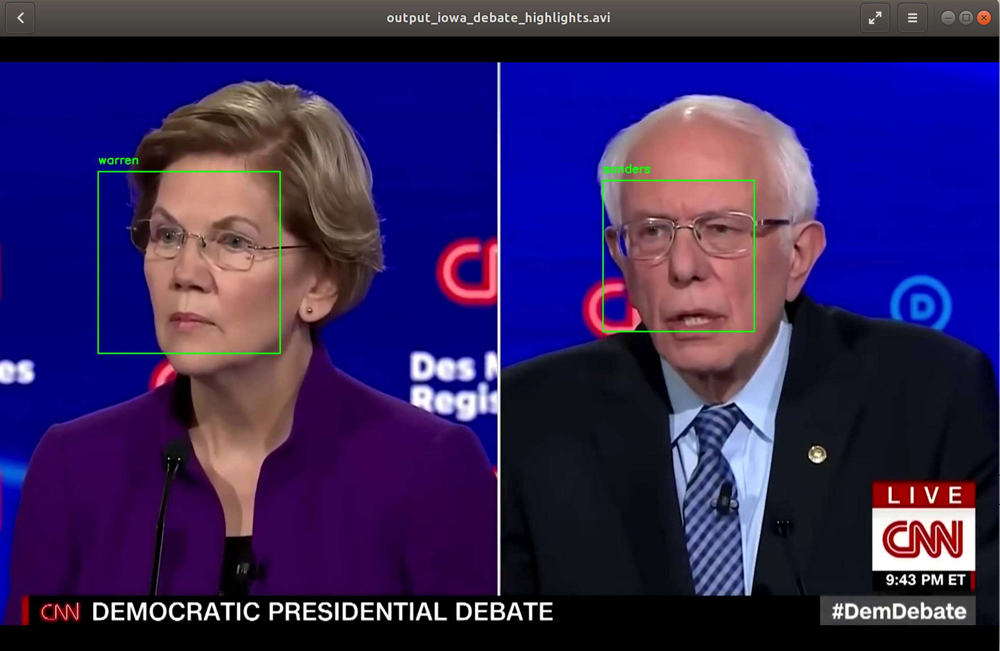
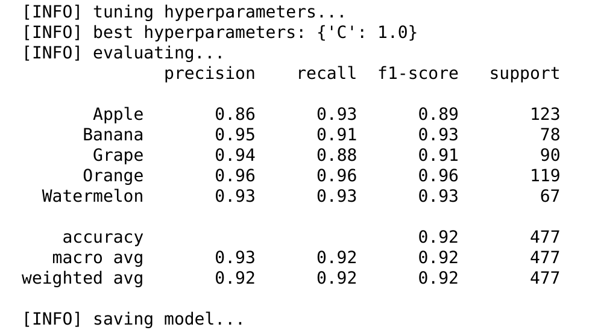
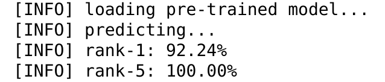
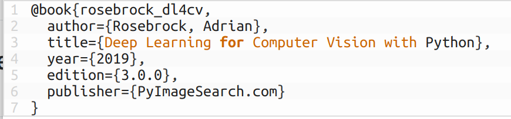

# Kevin Zehnder : Selected Projects

## 1. Tensorflow Object Detection API Example ([click to view project code](1_faster_rcnn_tensorflow/))

 Sample prediction #1      |  Sample prediction #2
:-------------------------:|:-------------------------:
 | 

## 2. President Detector ([Click here to view project code](2_president_detector/))

  

## 3. Fruit VGG-16 classifier ([click here to view project code](3_fruit_VGG_feature_extractor_logistic/))

features extracted from final pool layer of VGG conv net and a logisitic regression classifier was trained on top

Model Metrics              |  Rank-1/Rank-5 Accuracy
:-------------------------:|:-------------------------:
 | 

model=miniVGG16 dropout=False augmentation=False

## 4. Soda Bottles Transfer Learning -- miniVGG Feature Extractor + Logistic ([click here to view project code](4_soda_bottles_minivggnet_classifier/))

features extracted from final pool layer of miniVGG conv net and a logisitic regression classifier was trained on top

Model Metrics            |  Sample prediction #1
:-------------------------:|:-------------------------:
 | 

## 5. Boats Transfer Learning -- Fine-Tuning ([click here to view project code](5_transfer_learning_fine_tuning/))

features extracted from final pool layer of miniVGG conv net and a logisitic regression classifier was trained on top

Model Metrics            |  Sample prediction #1
:-------------------------:|:-------------------------:
 | 

# Citations
Code in this repository is heavily adapted from course content in the **PyImageSearch Gurus** and **Deep Learning for Computer Vision with Python** by Dr. Adrian Rosebrock. Please visit **https://www.pyimagesearch.com/pyimagesearch-gurus/** for additional information.

  

