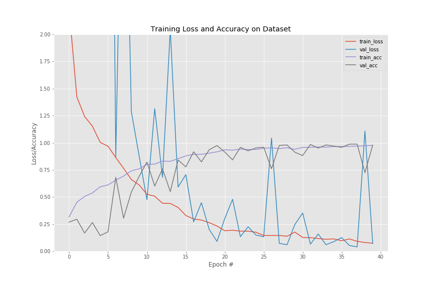

# Kevin Zehnder : Selected Projects
***Note: Please see citations section at the bottom of this page***

## 1. Faster R-CNN Tensorflow Object Detection API Example ([click to view project code](1_faster_rcnn_tensorflow/))

 Sample prediction #1      |  Sample prediction #2
:-------------------------:|:-------------------------:
 | 

 Sample prediction #3      |  Tensorboard 
:-------------------------:|:-------------------------:
 | 

## 2. President Detector ([Click here to view project code](2_president_detector/))

  

## 3. Fruit VGG-16 classifier ([click here to view project code](3_fruit_VGG_feature_extractor_logistic/))

Fruit Model Metrics              |  Fruit Rank-1/Rank-5 Accuracy
:-------------------------:|:-------------------------:
 | 

Fruit Example #1                 |  Fruit Example #2
:-------------------------:|:-------------------------:
 | 

## 4. Soda Bottles Transfer Learning -- miniVGG16net([click here to view project code](4_sodas_miniVGGnet_augmentation/))

Soda Bottle Example #1            |  Soda Bottle Example #2
:-------------------------:|:-------------------------:
 | 

Soda Bottle Model Metrics ***with*** Augmentation            |  Soda Bottle Training Plot ***with*** Augmentation
:-------------------------:|:-------------------------:
 | 

Soda Bottle Model Metrics ***without*** Augmentation            |  Soda Bottle Training Plot ***without*** Augmentation
:-------------------------:|:-------------------------:
 | 

## 5. Boats Transfer Learning -- Fine-Tuning ([click here to view project code](5_transfer_learning_fine_tuning/))

Model Metrics            |  Sample prediction #1
:-------------------------:|:-------------------------:
 | 

# Citations
Code in this repository is heavily adapted from course content in **PyImageSearch Gurus** and **Deep Learning for Computer Vision with Python** by **Dr. Adrian Rosebrock**. Please visit **https://www.pyimagesearch.com/pyimagesearch-gurus/** for additional information.

  

